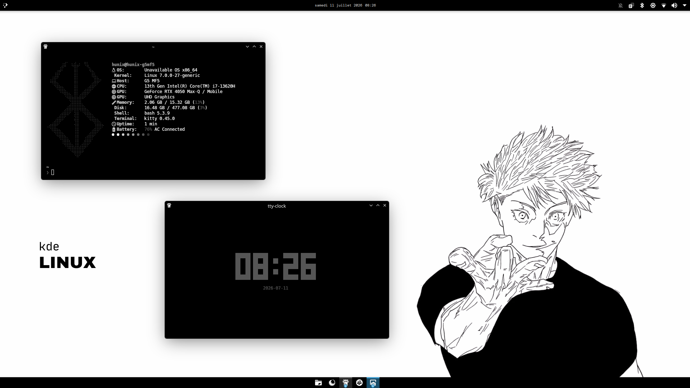

<div align="center">
    
    <h1>KDE Minimalistic Monochrome Rice</h1>
    <p>The simplest rice, yet the slickest one</p>
    
    
</div>

# Theme Configuration

Global Theme : Kubuntu Dark or Breeze Dark
Colors : Breeze Dark
App Style : Breeze
Plasma Style : Kubuntu Dark
Window Decoration : Breeze ( play with the theme's color palette to get a pure dark & white look )
Icons : Yet Another Monochrome Icon Set
Cursor : Breeze Light

## Quick Wallpaper Install (copy + paste)

```bash
# safer to work in the tmp directory
cd /tmp

wget https://raw.githubusercontent.com/hunixcode/icedcoffee/master/assets/wallpaper.png -o _tmp_wallpaper.png
sudo mv _tmp_wallpaper.png /usr/share/wallpapers/kde-gojo-wallpaper.png
```

Feel free to open an issue if you need further clarifications.